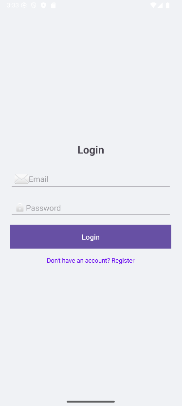
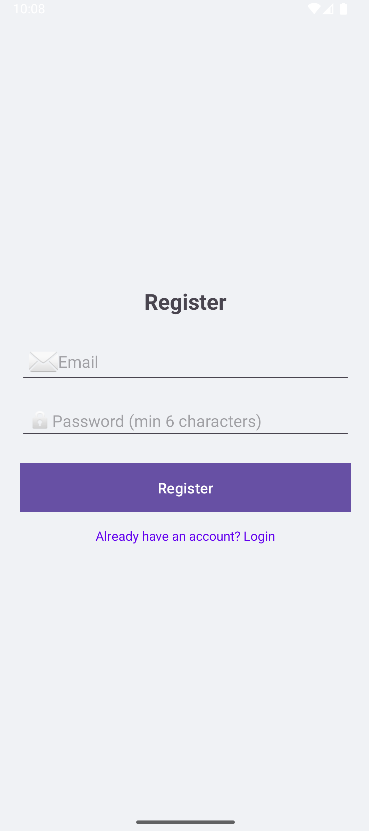
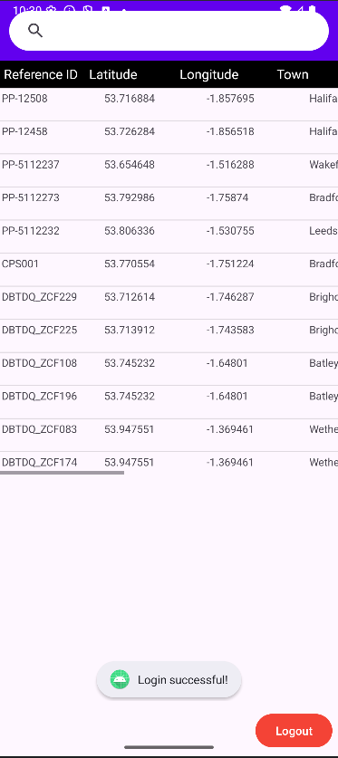
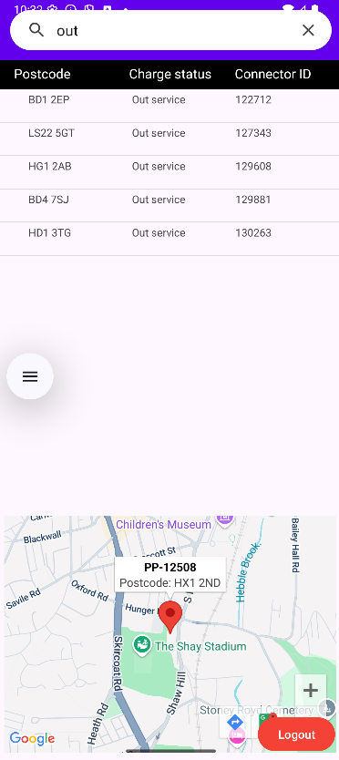

# EV Charging Point Finder

An Android app that helps electric vehicle drivers find nearby charging stations.

## Features
- User login and sign up
- Interactive Google Maps integration
- Search bar with filters
- Displays charging point locations with pins
- Uses SQLite database for charging station data

## Technologies
- Java
- Android Studio
- Google Maps API
- SQLite
- XML for layouts

## 🚀 How to Run This Project

### Prerequisites
- Android Studio (latest version recommended)
- Android SDK (installed via Android Studio)
- A Google Maps API key (free to obtain from Google Cloud Console)


## 📸 Screenshots

### Authentication
| Login Screen | Register Screen |
|--------------|-----------------|
|  |  |

### Main App
| Main List | Map View | Charging Point Details |
|-----------|----------|------------------------|
|  |  | 

### Search & Filter
| Search Results |
|----------------|
|  |

### Step-by-Step Setup

1. **Clone the repository**
 - Open git bash
 - Run:
   ```cd desktop```
   ```git clone https://github.com/shibraa-cs/EV-charging-app.git```

2. **You'll now have a folder called EV-charging-app on your Desktop**
   Open that folder in File Explorer – you'll see all your project files
   
3. **Open in android studio**
 - Open Android Studio
 - Click "Open an Existing Project"
 - Select the cloned project folder
4. **Add your google maps API key**
 - Navigate to app/src/main/res/values/google_maps_api.xml
 - Replace YOUR_API_KEY_HERE with your actual Google Maps API key
 - For security, avoid hardcoding keys – use local.properties instead
5. **Build and Run**
 - Connect an Android device via USB (with USB debugging enabled)
 - OR start an Android Virtual Device (AVD) in Android Studio
 - Click the green "Run" button (▶️) or press Shift + F10
6. **Start exploring**
 - Register a new account or sign in
 - Search for charging points near you
 - View locations on the interactive map

**Getting a google maps api key**
1. Go to Google Cloud Console
2. Create a new project or select an existing one
3. Enable the Maps SDK for Android API
4. Go to Credentials → Create Credentials → API Key
5. Restrict the key to Android apps for security
6. Copy the key and add it to your projectGo to Google Cloud Console


## What I Learned
- Integrating Google Maps API with custom markers
- Building user authentication (login/signup)
- Filtering database results based on user input
- Handling map interactions and location data

## 📊 Data Source
The charging point data used in this app was provided as part of a university assignment. 
The app imports this data from a CSV file and stores it locally using SQLite for fast 
and offline access.

This project was created as part of a university assignment. For educational and portfolio purposes only.

## Status
Complete and functional

## Author
Computer Science Graduate, University of Bradford
